# 🍕 Pizza Sales Data Analysis (SQL Project)

### 📊 Objective:
This project analyzes a pizza restaurant’s sales data to uncover business insights such as revenue trends, order patterns, and customer preferences using SQL queries.

---

## 📁 Dataset Used:
- <a href = "https://github.com/PhyoThiri2325/Data-Portfolio/blob/main/pizza_sales_analysis/dataset/pizza_sales.csv" target="_blank">Pizza Dataset</a>

---
## 🛠️ Tools Used:
- Microsoft SQL Server
- SSMS (SQL Server Management Studio)

  ---

## 🔄 Steps Followed:

### Step 1: Data Import  
Imported the dataset into SQL Server as a table named `pizza_sales`.

---

### Step 2: KPI Metrics Calculated

- **Total Revenue**  
```sql
SELECT SUM(total_price) AS Total_Revenue FROM pizza_sales;
```
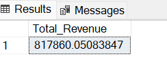

- **Average Order Value**  
```sql
SELECT SUM(total_price)/COUNT(DISTINCT order_id) AS Average_Order_Value FROM pizza_sales;
```
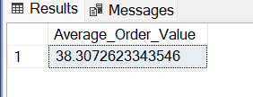

- **Total Pizzas Sold**  
```sql
SELECT SUM(quantity) AS Total_Pizza_Sold FROM pizza_sales;
```
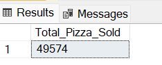

- **Total Orders**  
```sql
SELECT COUNT(DISTINCT order_id) AS Total_Orders FROM pizza_sales;
```
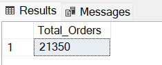


- **Average Pizzas Per Order**  
```sql
SELECT CAST(CAST(SUM(quantity) AS DECIMAL(10,2)) /
CAST(COUNT(DISTINCT order_id) AS DECIMAL(10,2)) AS DECIMAL(10,2)) AS Average_Pizza_Per_Order FROM pizza_sales;
```
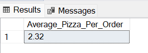

---

### Step 3: Time-Based Analysis

- **Orders by Day of the Week**
```sql
SELECT DATENAME(DW, order_date) AS Order_Day, COUNT(DISTINCT order_id) AS Total_Order 
FROM pizza_sales
GROUP BY DATENAME(DW, order_date);
```
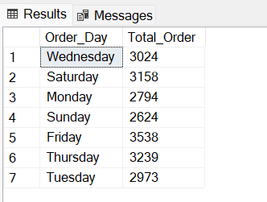

- **Orders by Month**
```sql
SELECT DATENAME(MONTH, order_date) AS Month_Name, COUNT(DISTINCT order_id) AS Total_Order 
FROM pizza_sales
GROUP BY DATENAME(MONTH, order_date)
ORDER BY Total_Order DESC;
```
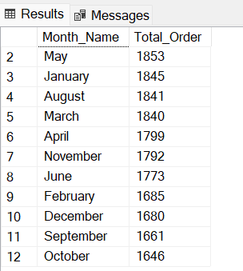

---

### Step 4: Sales Percentage by Category & Size

- **Sales Percentage by Pizza Category**
```sql
SELECT pizza_category, SUM(total_price) AS total_sales,
(SUM(total_price) / (SELECT SUM(total_price) FROM pizza_sales) * 100) AS Total_Sales_Percentage
FROM pizza_sales 
GROUP BY pizza_category;
```
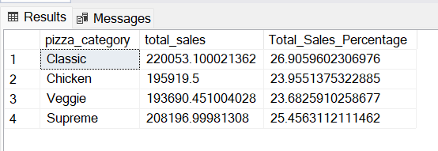

- **Sales Percentage by Pizza Size**
```sql
SELECT pizza_size, CAST(SUM(total_price) AS DECIMAL(10,2)) AS total_sales,
CAST((SUM(total_price)/(SELECT SUM(total_price) FROM pizza_sales)*100) AS DECIMAL(10,2)) AS Sales_Percentage_By_Size
FROM pizza_sales
GROUP BY pizza_size
ORDER BY Sales_Percentage_By_Size DESC;
```
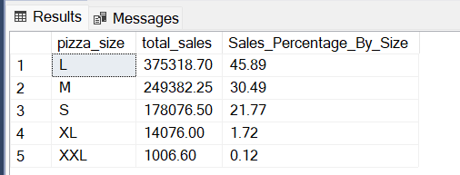

---

### Step 5: Best and Worst Sellers

- **Bottom 5 Pizzas by Revenue**
```sql
SELECT TOP 5 pizza_name, SUM(total_price) AS Total_Revenue
FROM pizza_sales
GROUP BY pizza_name
ORDER BY Total_Revenue ASC;
```
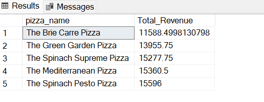

- **Top 5 Pizzas by Quantity Sold**
```sql
SELECT TOP 5 pizza_name, SUM(quantity) AS Total_Quantity
FROM pizza_sales
GROUP BY pizza_name
ORDER BY Total_Quantity DESC;
```
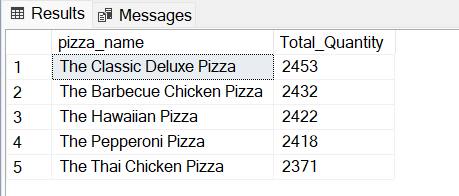

- **Bottom 5 Pizzas by Quantity Sold**
```sql
SELECT TOP 5 pizza_name, SUM(quantity) AS Total_Quantity
FROM pizza_sales
GROUP BY pizza_name
ORDER BY Total_Quantity ASC;
```
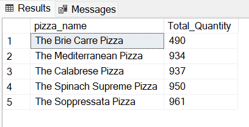

- **Top 5 Pizzas by Total Orders**
```sql
SELECT TOP 5 pizza_name, COUNT(DISTINCT order_id) AS Total_Orders
FROM pizza_sales
GROUP BY pizza_name
ORDER BY Total_Orders DESC;
```


- **Bottom 5 Pizzas by Total Orders**
```sql
SELECT TOP 5 pizza_name, COUNT(DISTINCT order_id) AS Total_Orders
FROM pizza_sales
GROUP BY pizza_name
ORDER BY Total_Orders ASC;
```
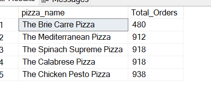

---

## 📌 Key Insights

- The **average order value** gives an idea of typical customer spending.
- **Fridays and Thursday** are likely peak order days.
- **Large and medium-sized pizzas** contribute the most to total sales.
- The **top-performing pizzas** by revenue and quantity can be prioritized for promotions.
- Insights like **bottom 5 pizzas** help identify products that may be discontinued or improved.

---

## 📚 Data Source:
- Sample pizza sales dataset from a fictional restaurant

---

## 🧠 Learnings:
- Strong SQL querying using `GROUP BY`, `JOIN`, `ORDER BY`, `CAST`, `DECIMAL`, `TOP`, and date functions
- Aggregation and business KPI extraction
- Real-world restaurant sales scenario analysis
